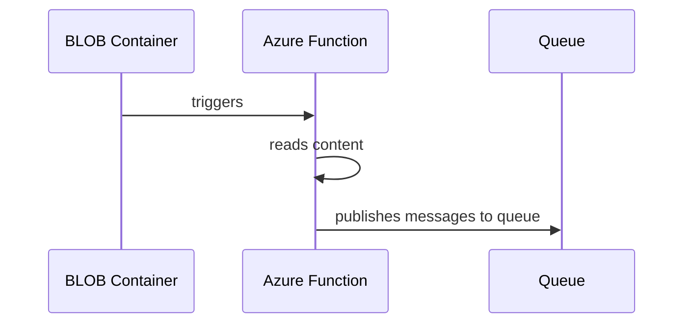

# :zap: Azure Functions Build and Deployment

## :rocket: Goals

**:bulb: Modularized Deployments Using Azure Bicep and GitHub Actions**

Most of the time, the team is unaware how the Azure resources are provisioned. This makes it hard for a team to have accountability of deployments especially when a deployment fails. It would be great if we can have components to deploy as modules, so  the team is fully aware about how and why these components are necessary. Also diagnosing depoyment failures will be much more easier.

**:bulb: Identity Based Azure Functions For Better Security**

Needless to say that storing connection strings, and other sensitive data in function as plain text is a high security risk. In here we are going to use Identity based Azure functions with RBAC.

**:bulb: To Locally Verify Build Automation To Avoid Unnecessary Build Failures**

Build automation tasks can vary depending on the component you build. It's always better to run all the build tasks locally and verify whether it succeeds before pushing
the code.

## :tada: Demo App

## :hammer_and_wrench: Infrastructure

This Azure function requires the below Azure resources

- Storage Account
  - BLOB Container
  - Queue
- Key Vault
- App Insights
- App Service Plan
- Function App and Settings
- RBAC for Function App to Access BLOB Container and Queue

We use `Azure Bicep` with `GHA` to automate deployment to Azure.

## :sparkles: Build Automation

Below tasks are required for a successful build

* All Tests Must Pass
* Code Must be Correctly Formatted
* Lint OaS for the Swagger Files

We use `NUKE` for these tasks